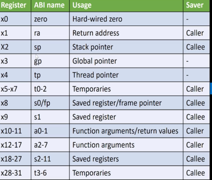
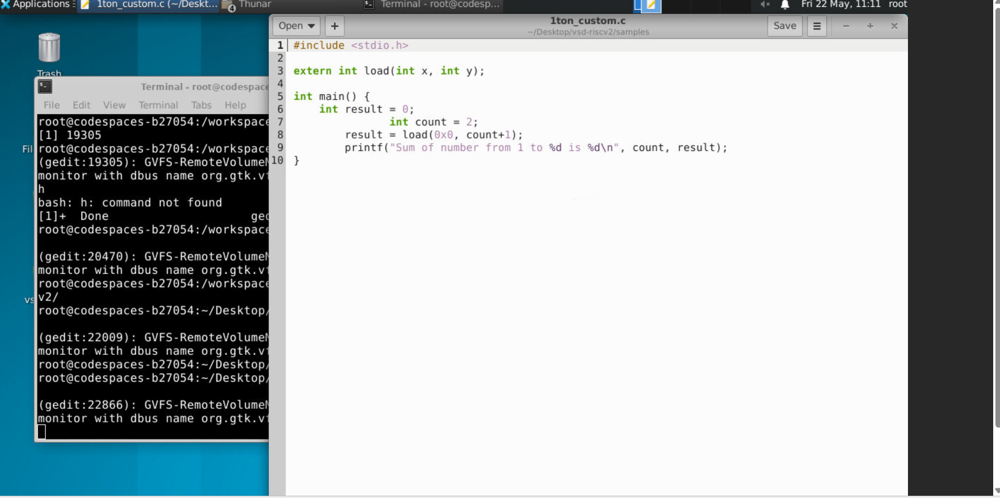
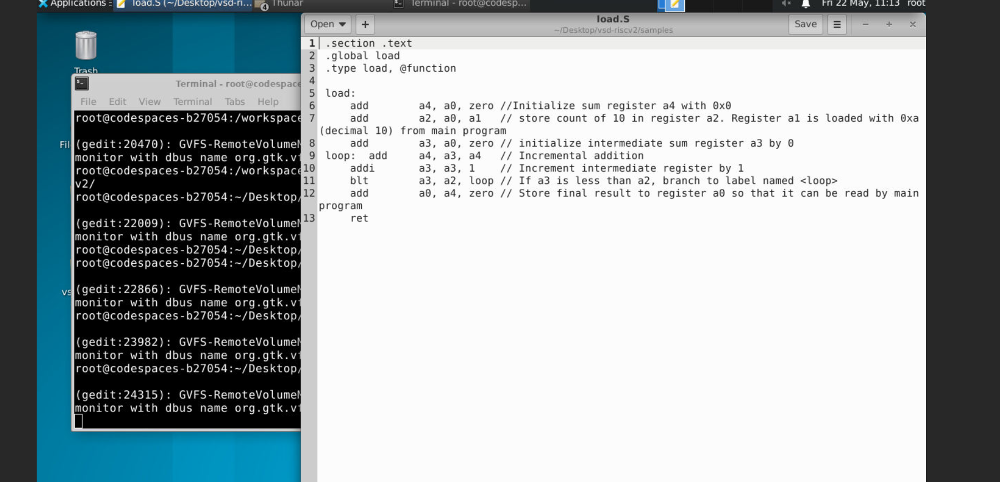
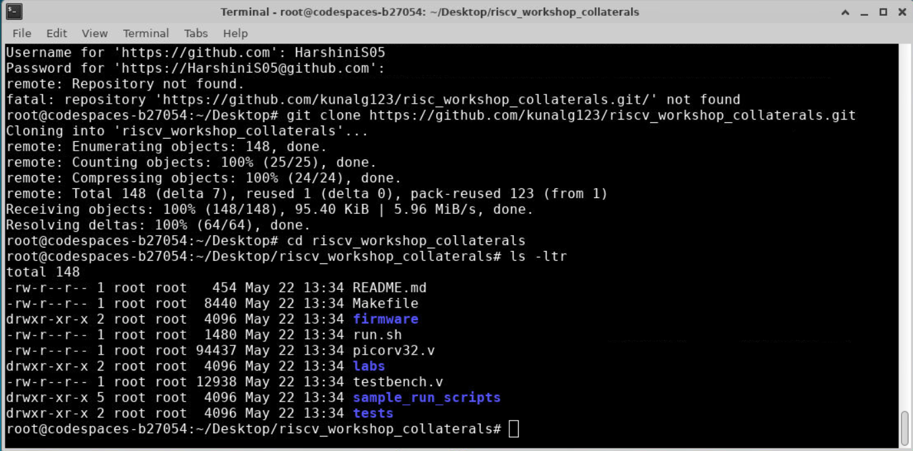
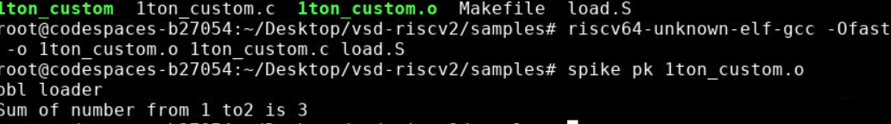

# Day 2 – Application Binary Interface (ABI) and Basic Verification Flow

## Overview

Day 2 focuses on the **Application Binary Interface (ABI)** — the interface
that defines how application programs access hardware resources through the
operating system. It covers RISC-V register conventions, instruction encoding
formats, memory addressing, and a hands-on lab where a C program calls an
assembly function to compute a sum.

---

## Topics Covered

- What is the ABI and where it fits in the software stack
- RISC-V registers — naming, width, and ABI roles
- Memory addressing — little-endian byte ordering
- Load and store instructions (ld, sd, add)
- Instruction encoding formats (I-type, R-type, S-type)
- Lab: rewriting a C program using inline assembly (ASM)
- Lab: running on PicoRV32 RTL simulation

---

## Section 1: Application Binary Interface (ABI)

### Concept

The **ABI** is the lowest-level interface between application software and
the hardware, mediated by the operating system. It defines:

- How function arguments are passed (which registers)
- How return values are communicated back
- How the stack is managed
- How system calls are made

The ABI sits between the **API** (application-facing) and the **ISA**
(hardware-facing):

```
Application Program
   ↓  API (e.g., printf, malloc)
Standard Libraries / OS
   ↓  ABI — System Call Interface
ISA (RISC-V instructions)
   ↓
RTL / Hardware
```

### Screenshot
![] (screenshots/day2/2.png)

---

## Section 2: RISC-V Registers

### Register Width

For RV64 (64-bit RISC-V), all registers are **XLEN = 64 bits** wide.
RISC-V has **32 integer registers**, named x0 through x31.

- 5 bits are needed to identify a register (2^5 = 32 registers)
- Each register holds one 64-bit value

### ABI Register Names and Roles

| Register | ABI Name | Usage | Saver |
|----------|----------|-------|-------|
| x0 | zero | Hard-wired zero — always reads 0, writes ignored | — |
| x1 | ra | Return address | Caller |
| x2 | sp | Stack pointer | Callee |
| x3 | gp | Global pointer | — |
| x4 | tp | Thread pointer | — |
| x5–x7 | t0–t2 | Temporaries | Caller |
| x8 | s0/fp | Saved register / frame pointer | Callee |
| x9 | s1 | Saved register | Callee |
| x10–x11 | a0–a1 | Function arguments / return values | Caller |
| x12–x17 | a2–a7 | Function arguments | Caller |
| x18–x27 | s2–s11 | Saved registers | Callee |
| x28–x31 | t3–t6 | Temporaries | Callee |

**Caller-saved:** The calling function must save these if it needs them after
the call. **Callee-saved:** The called function must restore these before
returning.

### Screenshot



---

## Section 3: Memory, Little-Endian Addressing, and Loading Data

### Little-Endian Byte Ordering

RISC-V uses **little-endian** byte ordering. This means the **least
significant byte** of a multi-byte value is stored at the **lowest memory
address**.

For a 64-bit (double word) value stored starting at address 16:

```
Address  Byte stored
  16     Byte 0  (bits  7:0)   ← LSByte
  17     Byte 1  (bits 15:8)
  18     Byte 2  (bits 23:16)
  19     Byte 3  (bits 31:24)
  20     Byte 4  (bits 39:32)
  21     Byte 5  (bits 47:40)
  22     Byte 6  (bits 55:48)
  23     Byte 7  (bits 63:56)  ← MSByte
```

### Accessing a Double Word from Memory

To load the value stored at byte addresses 16–23 into register x8, with the
base address already stored in x23:

```asm
ld   x8, 16(x23)    # Load double word: x8 = Memory[x23 + 16]
```

- `ld` = load doubleword (64-bit)
- `x8` = destination register (rd)
- `16` = byte offset (immediate)
- `x23` = base address register (rs1)

### Array of 3 Double Words — Example

If register x23 holds the base address of an array of 3 double words
(each 8 bytes), the byte addresses are:

| Element | Byte Address | Access Command |
|---------|-------------|----------------|
| [0] | base + 0 | `ld x8, 0(x23)` |
| [1] | base + 8 | `ld x8, 8(x23)` |
| [2] | base + 16 | `ld x8, 16(x23)` |

To access the **3rd double word** (index 2), use offset 16 from the base.


---

## Section 4: Instruction Encoding Formats

### Overview

All RISC-V instructions are exactly **32 bits** wide. Different instruction
types use different field layouts. The `opcode` field (bits [6:0]) identifies
the instruction type.

5 bits are used to identify each register (2^5 = 32 registers).

### I-type (Immediate) — Used by Load Instructions

```
 31        20 | 19   15 | 14  12 | 11    7 | 6      0
  immediate   |   rs1   | funct3 |   rd    | opcode
    [31:20]   |  [19:15]| [14:12]| [11:7]  | [6:0]
```

**Example:** `ld x8, 16(x23)` encodes as I-type:
- `imm` = 16 (offset)
- `rs1` = x23 (base register)
- `funct3` = 011 (doubleword)
- `rd` = x8 (destination)
- `opcode` = 0000011 (load)

### R-type (Register) — Used by Arithmetic Instructions

```
 31      25 | 24   20 | 19   15 | 14  12 | 11    7 | 6      0
   funct7   |   rs2   |   rs1   | funct3 |   rd    | opcode
   [31:25]  |  [24:20]| [19:15] | [14:12]| [11:7]  | [6:0]
```

**Example:** `add x8, x24, x8` encodes as R-type:
- `funct7` = 0000000
- `rs2` = x8
- `rs1` = x24
- `funct3` = 000
- `rd` = x8
- `opcode` = 0110011

### S-type (Store) — Used by Store Instructions

```
 31      25 | 24   20 | 19   15 | 14  12 | 11    7 | 6      0
 imm[11:5]  |   rs2   |   rs1   | funct3 | imm[4:0]| opcode
   [31:25]  |  [24:20]| [19:15] | [14:12]| [11:7]  | [6:0]
```

The immediate is **split** across two fields: bits [11:5] in the upper field
and bits [4:0] in the lower field.

**Example:** `sd x8, 8(x23)` encodes as S-type:
- `imm[11:5]` = upper 7 bits of 8
- `rs2` = x8 (data register)
- `rs1` = x23 (base address)
- `funct3` = 011 (doubleword)
- `imm[4:0]` = lower 5 bits of 8
- `opcode` = 0100011 (store)

### Instruction Format Summary

| Format | Used For | Has rs2 | Has rd | Has imm |
|--------|---------|---------|--------|---------|
| I-type | Loads, ADDI, JALR | No | Yes | Yes (12-bit) |
| R-type | ADD, SUB, AND, OR, XOR, shifts | Yes | Yes | No |
| S-type | Stores (SW, SD, SB) | Yes | No | Yes (split) |
| B-type | Branches | Yes | No | Yes (split) |
| U-type | LUI, AUIPC | No | Yes | Yes (20-bit) |
| J-type | JAL | No | Yes | Yes (20-bit, split) |


---

## Section 5: Lab — Rewriting C Program Using ASM Language

### Concept

In this lab, the sum-of-1-to-9 program is split into two files:

- `1ton_custom.c` — main C program that calls an external assembly function
- `load.S` — RISC-V assembly function that performs the actual computation

The C program passes arguments via registers a0 and a1 (per the ABI), and
the assembly function returns the result in a0.

### Algorithm Flowchart

```
Start
  ↓
Initialize a4 = 0   (sum accumulator)
  ↓
Initialize a3 = 0   (loop counter)
  ↓
Store count 10 in a2
  ↓
┌─────────────────┐
│  a4 = a3 + a4   │  ← sum += counter
│  a3 = a3 + 1    │  ← counter++
│  if a3 < a2 ?   │──── yes ──→ (loop back)
└─────────────────┘
  ↓ no
a0 = a4 + zero      (store result in return register)
  ↓
Return a0 to main C program
  ↓
End
```

### C Source File: `1ton_custom.c`

```c
#include <stdio.h>

extern int load(int x, int y);

int main() {
    int result = 0;
    int count  = 9;
    result = load(0x0, count + 1);
    printf("Sum of numbers from 1 to %d is %d\n", count, result);
}
```

- `extern int load(int x, int y)` — declares the assembly function
- `load(0x0, count+1)` — passes a0=0 and a1=10 to the assembly function
- The return value (in a0) is stored in `result`

### Assembly File: `load.S`

```asm
.section .text
.global load
.type load, @function

load:
    add   a4, a0, zero  // Initialize sum register a4 with 0x0
    add   a2, a0, a1    // Store count of 10 in a2 (a1 loaded with 0xa from main)
    add   a3, a0, zero  // Initialize intermediate sum register a3 by 0

loop:
    add   a4, a3, a4    // Incremental addition: sum += counter
    addi  a3, a3, 1     // Increment counter by 1
    blt   a3, a2, loop  // If a3 < a2, branch to loop

    add   a0, a4, zero  // Store final result in a0 (return register)
    ret
```

### Register Usage in This Lab

| Register | ABI Name | Role in This Program |
|----------|----------|---------------------|
| a0 | a0 | Input arg 1 (0x0) → return value (sum) |
| a1 | a1 | Input arg 2 (count+1 = 10) |
| a2 | a2 | Loop limit (10) |
| a3 | a3 | Loop counter (i: 0 to 9) |
| a4 | a4 | Running sum accumulator |

### Screenshot




---

## Section 6: Lab Commands

### Compilation and Simulation

```bash
# Open source files for editing
leafpad 1to9_custom.c &
leafpad load.S

# View file contents
cat 1to9_custom.c
cat load.S

# Compile C + Assembly together with RISC-V GCC
riscv64-unknown-elf-gcc -ofast -mabi=lp64 -march=rv64i \
    -o 1to9custom.o 1to9custom.c load.S

# Run on spike RISC-V simulator
spike pk 1to9custom.o

# Disassemble to inspect the generated RISC-V instructions
riscv64-unknown-elf-objdump -d 1to9custom.o | less
```

### Running on PicoRV32 RTL

```bash
# Clone the workshop repository
git clone https://github.com/kunalg123/risc_workshop_collaterals.git

# Navigate to labs
cd risc_workshop_collaterals
cd labs
ls -ltr

# Inspect RTL and testbench
vim picorv32.v
vim testbench.v
vim run.sh

# Edit the test program
vim 1ton_custom.c

# Make the simulation script executable and run
chmod 777 run.sh
./run.sh

# Inspect generated firmware
vim firmware.hex
vim firmware32.hex
```

### What Each File Does

| File | Purpose |
|------|---------|
| `picorv32.v` | RTL implementation of PicoRV32 RISC-V CPU in Verilog |
| `testbench.v` | Verilog testbench — instantiates CPU and memory |
| `rv32im.sh` | Script: compiles C to hex, loads into testbench, runs iverilog |
| `firmware.hex` | 64-bit hex machine code loaded into simulated instruction memory |
| `firmware32.hex` | 32-bit word hex representation of the same firmware |

### Screenshot

 

![]screenshots/day2/8.png)


---

## Key Concepts Summary

| Concept | Summary |
|---------|---------|
| ABI | Defines register roles, calling convention, system call interface |
| XLEN | Register width — 64 bits for RV64 |
| 32 registers | x0–x31; 5 bits to select one register |
| x0 / zero | Always reads 0; writes are silently discarded |
| a0–a1 | Function return values and first two arguments |
| a2–a7 | Additional function arguments |
| Little-endian | LSByte stored at lowest address |
| ld rd, imm(rs1) | Load double word: rd = Memory[rs1 + imm] |
| sd rs2, imm(rs1) | Store double word: Memory[rs1 + imm] = rs2 |
| I-type | Load / immediate arithmetic — 12-bit immediate |
| R-type | Register arithmetic — two source registers |
| S-type | Store — immediate split across two fields |
| ret | Return from function (pseudo-instruction for jalr x0, ra, 0) |

---

## References

- RISC-V ISA specification: https://riscv.org/technical/specifications/
- Workshop collaterals: https://github.com/kunalg123/risc_workshop_collaterals
- PicoRV32 RTL: https://github.com/YosysHQ/picorv32
- VSD MYTH Workshop: https://www.vlsisystemdesign.com
