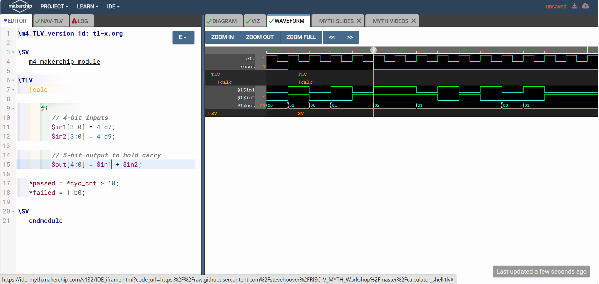
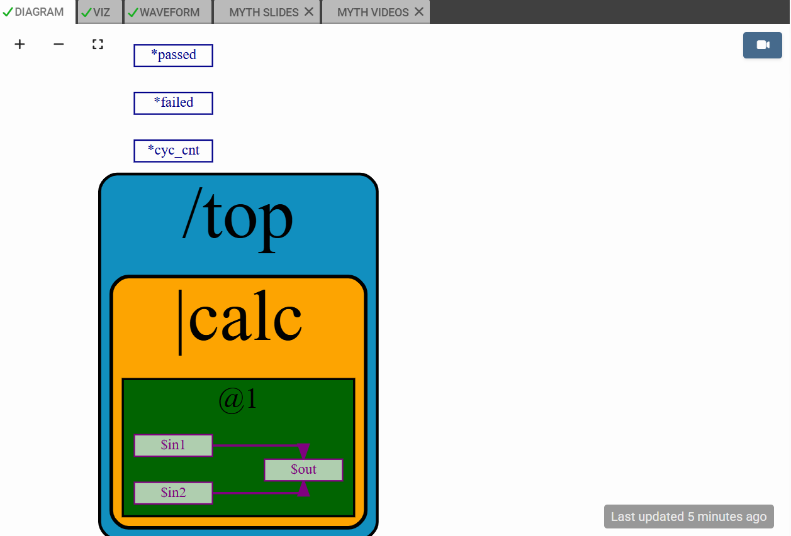
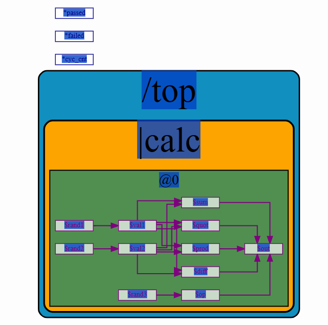
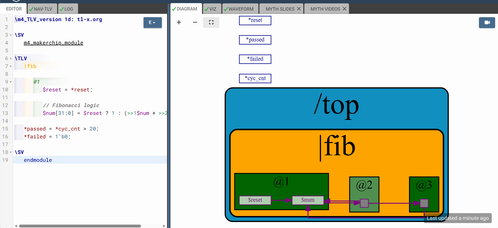
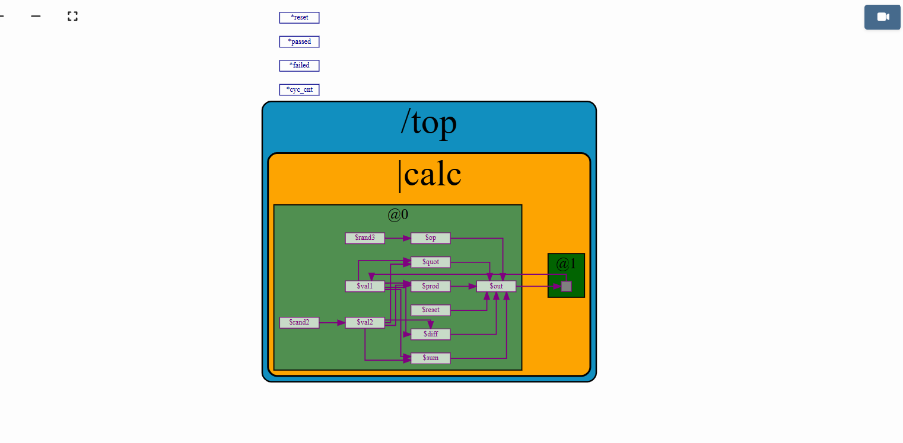
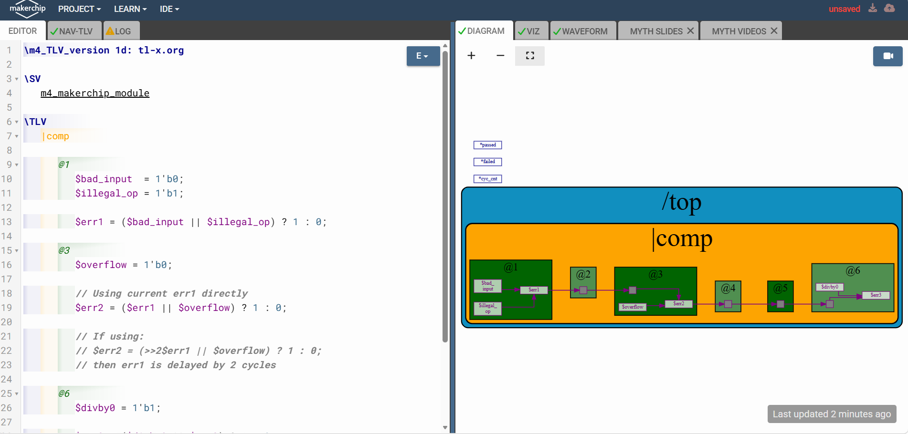
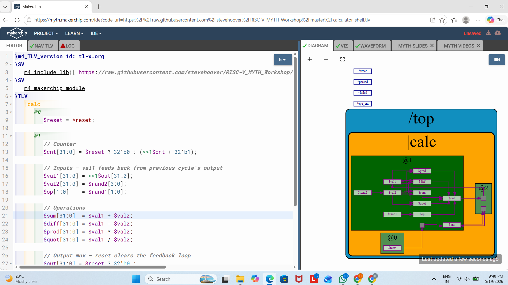
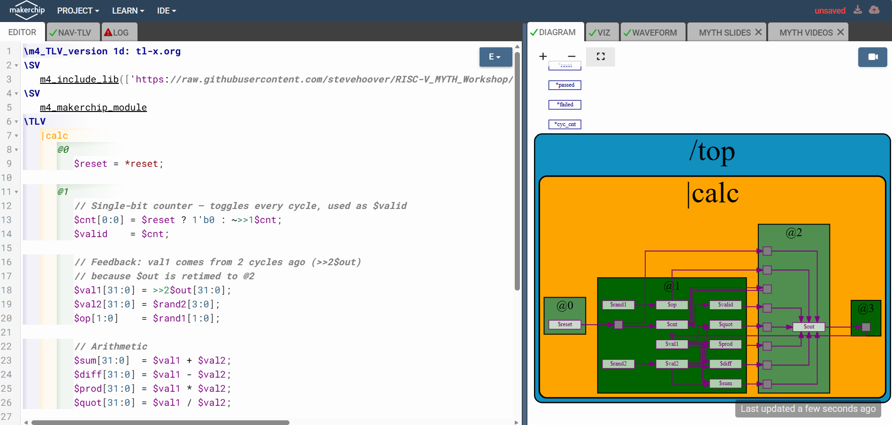
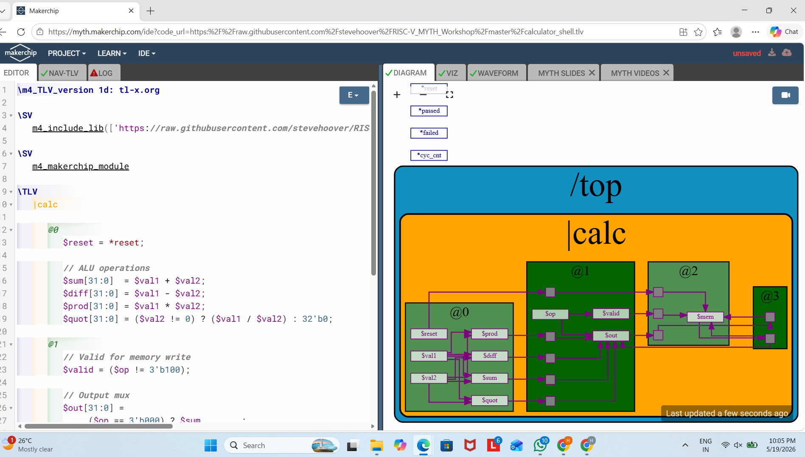

# Day 3 – Digital Logic with TL-Verilog in Makerchip IDE

## Building a RISC-V Core using TL-Verilog

---

#  Objective

The objective of Day 3 was to understand the fundamentals of digital hardware design using TL-Verilog and Makerchip IDE.

This session focused on:
- Basic digital logic
- Combinational circuits
- Sequential circuits
- Pipelines
- Timing abstraction
- Validity concepts
- Hierarchical hardware design

These concepts form the foundation for building a complete pipelined RISC-V CPU in the following modules.

---

#  Tools Used

- Makerchip IDE
- TL-Verilog
- GTKWave

---

# Introduction to TL-Verilog

TL-Verilog (Transaction-Level Verilog) is a hardware description language developed to simplify digital design and pipelining.

Unlike traditional Verilog/SystemVerilog:
- No manual pipeline register handling
- Easier retiming
- Cleaner syntax
- Timing abstraction support
- Reduced hardware bugs

TL-Verilog automatically handles pipeline stage movement and signal propagation.

---

#  Logic Gates

## Aim

Understand basic logic gate implementation using TL-Verilog.

---

# Theory

Logic gates are the building blocks of digital electronics.

Common logic gates:
- NOT
- AND
- OR
- XOR
- NAND
- NOR
- XNOR

These gates perform boolean operations on binary inputs.

---


---

#  Lab 2 – Combinational Logic

## Aim

Understand combinational circuit design.

---

#  Theory

Combinational circuits:
- Depend only on present inputs
- Do not store previous states
- Produce immediate outputs

Examples:
- Adders
- Multiplexers
- Encoders
- Decoders

---

# Vector Addition

## Code

```tlv
$out[4:0] = $in1[3:0] + $in2[3:0];
```

---

## Explanation

This performs addition between two 4-bit numbers.

### Vector Representation

```tlv
$in1[3:0]
```

means:
- 4-bit signal
- bits 3 down to 0

The result is stored in a 5-bit output to accommodate carry.

Example:

```text
0101 + 0011 = 1000
```
```tlv
\m4_TLV_version 1d: tl-x.org

\SV

m4 makerchip_module

-\TLV

calc

@1

// 4-bit inputs

$in1 [3:0] = 4'd7;

$in2[3:0] = 4'd9;

// 5-bit output to hold carr

$out[4:0] = $in1 + $in2;

*passed = *cyc_cnt > 10;

*failed = 1'b0;

B 1

ISV

endmodule
```
---

## Screenshot




---

Vectors allow arithmetic operations on multi-bit binary numbers.

---

#  Lab 3 – Multiplexer (MUX)

## Aim

Design a multiplexer using TL-Verilog.

---

#  Theory

A multiplexer selects one input from multiple inputs based on a select signal.

MUX acts like a digital switch.

---

## Code

```tlv
\m4_TLV_version 1d: tl-x.org
\SV
m4_makerchip_module
\TLV
   |mux
      @1
         // 8-bit vector inputs
         $in1[7:0] = 8'b10101010;
         $in2[7:0] = 8'b01010101;
         
         // Select signal
         $sel = 1'b1;
         
         // 8-bit vector multiplexer
         $out[7:0] = $sel ? $in1[7:0] : $in2[7:0];
         
         // Simulation control
         *passed = *cyc_cnt > 20;
         *failed = 1'b0;
\SV
endmodule

```

---

## Explanation

This is a 2:1 multiplexer.

If:
- `$sel = 1` → output = `$in1`
- `$sel = 0` → output = `$in2`

The `? :` operator is called the ternary operator.

Equivalent meaning:

```text
if (sel)
   out = in1
else
   out = in2
```

---

## Screenshot


---

# Key Learning

Multiplexers are heavily used in CPUs for selecting:
- ALU operations
- Register values
- Memory data
- Branch paths

---

#  Lab 4 – Combinational Calculator

## Aim

Build a calculator performing arithmetic operations.

---

# Theory

The calculator combines:
- Arithmetic units
- Multiplexers
- Control logic

This resembles a simplified ALU.

---

## Code

```tlv
\TLV
   |calc
      @0
         $reset = *reset;

         // Small random input values
         $val1[31:0] = $rand1[3:0];
         $val2[31:0] = $rand2[3:0];

         // Operation select
         // 00 = add
         // 01 = subtract
         // 10 = multiply
         // 11 = divide
         $op[1:0] = $rand3[1:0];

         // Arithmetic operations
         $sum[31:0]  = $val1 + $val2;
         $diff[31:0] = $val1 - $val2;
         $prod[31:0] = $val1 * $val2;

         // Avoid divide-by-zero
         $quot[31:0] = ($val2 != 0) ? ($val1 / $val2) : 32'b0;

         // Output mux using encoded select
         $out[31:0] =
            ($op == 2'b00) ? $sum  :
            ($op == 2'b01) ? $diff :
            ($op == 2'b10) ? $prod :
                              $quot;

   // Uncomment for visualization
   //m4+cal_viz(@0)

   // Assert these to end simulation
   *passed = *cyc_cnt > 40;
   *failed = 1'b0;
```

---

## Explanation

Operations:
- `00` → Addition
- `01` → Subtraction
- `10` → Multiplication
- `11` → Division

The multiplexer selects the required arithmetic result based on `$op`.

---

## Screenshot



---

#  Key Learning

This design introduces ALU-like operation selection logic.

---

#  Sequential Logic

## Aim

Understand clock-based digital circuits.

---

# 📖 Theory

Sequential circuits:
- Depend on present input
- Depend on previous state
- Use clock signals
- Store data

Examples:
- Counters
- Registers
- FSMs
- Pipelines

---

# Fibonacci Generator

## Code

```tlv
         @0
         $reset = *reset;
         $num[31:0] = $reset ? 1 :
             (>>1$num + >>2$num);
         *passed = *cyc_cnt > 40;
         *failed = 1'b0;

```

---

## Explanation

This generates Fibonacci numbers.

### Important Operator

```tlv
>>1$num
```

means:
- previous cycle value

```tlv
>>2$num
```

means:
- value from 2 cycles ago

Example:

```text
1, 1, 2, 3, 5, 8, 13...
```

---

## Screenshot



---

# Key Learning

Sequential logic introduces memory into digital circuits.


---

#  Sequential Calculator

## Aim

Create a calculator using previous outputs.

---

# Theory

Sequential calculators store results from previous operations.

This introduces feedback paths.

---

## Explanation

The output from one cycle becomes input for the next cycle.

This mimics memory behavior.

---
```tlv


\TLV
   |calc
      @0

         $reset = *reset;

         // Operation select
         // 00 = add
         // 01 = subtract
         // 10 = multiply
         // 11 = divide
         $op[1:0] = $rand3[1:0];

         // Sequential behavior:
         // val1 gets previous cycle result
         $val1[31:0] = >>1$out;

         // Random second operand
         $val2[31:0] = $rand2[3:0];

         // Arithmetic operations
         $sum[31:0]  = $val1 + $val2;
         $diff[31:0] = $val1 - $val2;
         $prod[31:0] = $val1 * $val2;

         // Avoid divide-by-zero
         $quot[31:0] = ($val2 != 0) ? ($val1 / $val2) : 32'b0;

         // Output select with reset
         $out[31:0] =
            $reset ? 32'b0 :
            (($op == 2'b00) ? $sum  :
             ($op == 2'b01) ? $diff :
             ($op == 2'b10) ? $prod :
                               $quot);

   // Uncomment for visualization
   //m4+cal_viz(@0)

   *passed = *cyc_cnt > 50;
   *failed = 1'b0;

\SV
   endmodule
```


## Screenshot



---

#  Pipelined Logic

## Aim

Understand pipelining and timing abstraction.

---

# Theory

Pipelining divides computations into stages.

Benefits:
- Higher frequency
- Better throughput
- Improved performance

---


#  Lab – Pipeline Error Detection Logic

## Aim

Understand pipelined logic and signal propagation across multiple pipeline stages using TL-Verilog.

This lab demonstrates how error signals move through different pipeline stages and how multiple error conditions are combined.

---

# Theory

In pipelined digital systems, computations are divided into multiple stages.

Each stage executes a portion of the logic during a clock cycle.

Pipeline stages improve:
- Performance
- Throughput
- Timing efficiency

TL-Verilog simplifies pipelined hardware design using:
- Timing abstraction
- Automatic stage management
- Simplified retiming

---

# Pipeline Stages Used

This design contains:
- Stage @1
- Stage @3
- Stage @6

Each stage performs different error checks.

---

## Code

```tlv
\m4_TLV_version 1d: tl-x.org

\SV
   m4_makerchip_module

\TLV
   |comp

      @1
         $bad_input  = 1'b0;
         $illegal_op = 1'b1;

         $err1 = ($bad_input || $illegal_op) ? 1 : 0;

      @3
         $overflow = 1'b0;

         // Using current err1 directly
         $err2 = ($err1 || $overflow) ? 1 : 0;

         // If using:
         // $err2 = (>>2$err1 || $overflow) ? 1 : 0;
         // then err1 is delayed by 2 cycles

      @6
         $divby0 = 1'b1;

         $err3 = ($divby0 || $err2) ? 1 : 0;

   *passed = *cyc_cnt > 40;
   *failed = 1'b0;

\SV
   endmodule
```

---

#  Step-by-Step Explanation

---

# Stage @1 – Initial Error Detection

```tlv
@1
   $bad_input  = 1'b0;
   $illegal_op = 1'b1;

   $err1 = ($bad_input || $illegal_op) ? 1 : 0;
```

---

## Explanation

Two error conditions are created:

| Signal | Meaning |
|---|---|
| `$bad_input` | Invalid input condition |
| `$illegal_op` | Illegal operation detected |

Values assigned:
```text
$bad_input  = 0
$illegal_op = 1
```

The OR operation checks whether any error exists.

```tlv
$err1 = ($bad_input || $illegal_op)
```

Since:
```text
0 || 1 = 1
```

Result:
```text
$err1 = 1
```

This means an error is detected in pipeline stage @1.

---

# Stage @3 – Overflow Detection

```tlv
@3
   $overflow = 1'b0;

   $err2 = ($err1 || $overflow) ? 1 : 0;
```

---

## Explanation

A new error condition:
```text
overflow
```

is introduced in stage @3.

Values:
```text
$overflow = 0
```

The stage combines:
- previous error (`$err1`)
- current overflow error

using OR logic.

Since `$err1` propagated through the pipeline:

```text
$err1 = 1
$overflow = 0
```

Therefore:

```text
1 || 0 = 1
```

Result:
```text
$err2 = 1
```

---

# Important Concept – Pipeline Signal Propagation

TL-Verilog automatically moves signals through pipeline stages.

Even though `$err1` was generated in stage @1, it becomes available in stage @3 automatically.

This is one of the biggest advantages of TL-Verilog timing abstraction.

---

# Delayed Signal Example

```tlv
>>2$err1
```

means:
```text
Value of err1 delayed by 2 cycles
```

If used:

```tlv
$err2 = (>>2$err1 || $overflow)
```

then:
- `$err1` would arrive after 2 clock cycles
- pipeline timing changes
- behavior becomes delayed

This demonstrates explicit pipeline delay control.

---

# Stage @6 – Division by Zero Detection

```tlv
@6
   $divby0 = 1'b1;

   $err3 = ($divby0 || $err2) ? 1 : 0;
```

---

## Explanation

Another error condition:
```text
division by zero
```

is checked.

Values:
```text
$divby0 = 1
$err2   = 1
```

OR operation:

```text
1 || 1 = 1
```

Result:
```text
$err3 = 1
```

Final error output indicates that an error occurred somewhere in the pipeline.

---

#  Pipeline Flow Visualization

```text
Stage @1
---------
bad_input
illegal_op
     ↓
   err1

Stage @3
---------
overflow
err1
   ↓
 err2

Stage @6
---------
divby0
err2
   ↓
 err3
```

---


## Screenshot



---

#  Key Learning

Through this lab, the following concepts were understood:

- Pipeline stage organization
- Signal propagation between stages
- Timing abstraction in TL-Verilog
- Delayed signal references using `>>`
- Multi-stage error handling
- Pipeline synchronization

---

#  Lab – Counter and Calculator in Pipeline

## Aim

Implement a counter and arithmetic calculator inside a TL-Verilog pipeline.

This lab demonstrates:
- Sequential logic
- Pipeline stage implementation
- Feedback paths
- Arithmetic datapath design
- Pipeline-based computation

---

# Counter and Calculator logic

---

## Code

```tlv
\TLV
   |calc
      @0
         $reset = *reset;
         
      @1
         // Counter
         $cnt[31:0] = $reset ? 0 : (>>1$cnt + 1);
         
         // Calculator inputs
         $val1[31:0] = >>1$out[31:0];
         $val2[31:0] = $rand2[3:0];
         $op[1:0]    = $rand1[1:0];
         
         // Arithmetic operations
         $sum[31:0]  = $val1 + $val2;
         $diff[31:0] = $val1 - $val2;
         $prod[31:0] = $val1 * $val2;
         $quot[31:0] = $val2 != 0 ? $val1 / $val2 : 32'b0;
         
         // Output mux
         $out[31:0] = $reset ? 32'b0 :
                      ($op == 2'b00) ? $sum  :
                      ($op == 2'b01) ? $diff :
                      ($op == 2'b10) ? $prod :
                                       $quot;
         
   //m4+cal_viz(@3) // Arg: Pipeline stage represented by viz, should be atleast equal to last stage of CALCULATOR logic.
   
   // Assert these to end simulation (before Makerchip cycle limit).
   *passed = *cyc_cnt > 40;
   *failed = 1'b0;
```

---

# 🔍 Step-by-Step Explanation

---

# Pipeline Structure

```text
|calc
   @0  → Reset stage
   @1  → Counter + Calculator logic
```

---

# Stage @0 – Reset Handling

```tlv
@0
   $reset = *reset;
```

---

## Explanation

The global reset signal is assigned into the pipeline.

Purpose of reset:
- Initialize hardware state
- Clear registers
- Start computation from known values

When reset becomes active:
- counter resets to 0
- calculator output resets to 0

---

# Stage @1 – Counter Logic

```tlv
$cnt[31:0] = $reset ? 0 : (>>1$cnt + 1);
```

---

## Explanation

This creates a free-running counter.

### Working

If reset is active:
```text
counter = 0
```

Otherwise:
```text
counter = previous counter + 1
```

---

# Important Sequential Operator

```tlv
>>1$cnt
```

means:
```text
counter value from previous cycle
```

Example sequence:

```text
0 → 1 → 2 → 3 → 4 ...
```

---

# Calculator Input Generation

```tlv
$val1[31:0] = >>1$out[31:0];
$val2[31:0] = $rand2[3:0];
$op[1:0]    = $rand1[1:0];
```

---

## Explanation

### `$val1`

Uses previous calculator output as current input.

```tlv
>>1$out
```

creates a feedback path.

This introduces sequential behavior.

---

### `$val2`

Random 4-bit value used as second operand.

---

### `$op`

Random operation selector.

Controls which arithmetic operation is performed.

---

# Arithmetic Operations

```tlv
$sum[31:0]  = $val1 + $val2;
$diff[31:0] = $val1 - $val2;
$prod[31:0] = $val1 * $val2;
$quot[31:0] = $val2 != 0 ? $val1 / $val2 : 32'b0;
```

---

## Explanation

The calculator computes all arithmetic results simultaneously.

Operations:
- Addition
- Subtraction
- Multiplication
- Division

---

# Division Protection

```tlv
$val2 != 0
```

prevents divide-by-zero errors.

If divisor becomes zero:
```text
output = 0
```

instead of illegal division.

---

# Output Multiplexer

```tlv
$out[31:0] =
   ($op == 2'b00) ? $sum  :
   ($op == 2'b01) ? $diff :
   ($op == 2'b10) ? $prod :
                    $quot;
```

---

## Explanation

This acts as an ALU output selector.

Depending on `$op`:

| Opcode | Operation |
|---|---|
| 00 | Addition |
| 01 | Subtraction |
| 10 | Multiplication |
| 11 | Division |

MUX selects one arithmetic result.

---

# 📖 Data Flow

```text
Previous Output
       ↓
     val1

Random Input
       ↓
     val2

Arithmetic Unit
 ┌─────────────┐
 │ +  -  *  / │
 └─────────────┘
       ↓
   Output MUX
       ↓
      out
```

---

# Pipeline Concepts Demonstrated

This lab demonstrates:
- Sequential feedback
- Pipeline execution
- Arithmetic datapath
- Multiplexer selection
- Counter implementation
- Timing abstraction

---

## Screenshot



---

# Key Learning

Through this lab, the following concepts were learned:

- Sequential logic using `>>`
- Pipeline stage implementation
- Counter design
- Arithmetic datapath creation
- Feedback path handling
- ALU-style operation selection
- Divide-by-zero protection

---
#  Lab – 2-Cycle Calculator Pipeline

## Aim

Implement a two-cycle pipelined calculator using TL-Verilog.

This lab demonstrates:
- Multi-cycle computation
- Valid signal control
- Retiming
- Alternate-cycle execution
- Pipeline synchronization

---

#  Theory

At high operating frequencies, completing all arithmetic operations in one cycle may become difficult.

To improve timing performance:
- computations are spread across multiple cycles
- pipeline stages are introduced
- outputs are generated only when valid

This improves:
- clock frequency
- timing stability
- hardware reliability

---

## Code

```tlv
\TLV
   |calc
      @0
         $reset = *reset;

      @1
         // Single-bit counter — toggles every cycle, used as $valid
         $cnt[0:0] = $reset ? 1'b0 : ~>>1$cnt;
         $valid    = $cnt;

         // Feedback: val1 comes from 2 cycles ago (>>2$out)
         // because $out is retimed to @2
         $val1[31:0] = >>2$out[31:0];
         $val2[31:0] = $rand2[3:0];
         $op[1:0]    = $rand1[1:0];

         // Arithmetic
         $sum[31:0]  = $val1 + $val2;
         $diff[31:0] = $val1 - $val2;
         $prod[31:0] = $val1 * $val2;
         $quot[31:0] = $val1 / $val2;

      @2
         // Output mux — retimed to @2 to ease timing
         // When not valid (alternate cycles), hold 32'b0
         $out[31:0] = ($reset | ~$valid) ? 32'b0 :
                      ($op == 2'b00)      ? $sum  :
                      ($op == 2'b01)      ? $diff :
                      ($op == 2'b10)      ? $prod :
                                            $quot;

   *passed = *cyc_cnt > 40;
   *failed = 1'b0;


```

---

#  Step-by-Step Explanation

---

# Pipeline Structure

```text
|calc
   @0 → Reset stage
   @1 → Arithmetic stage
   @2 → Output stage
```

---

# Stage @0 – Reset Logic

```tlv
@0
   $reset = *reset;
```

---

## Explanation

Initializes the pipeline.

Reset clears:
- outputs
- counters
- pipeline state

---

# Stage @1 – Valid Generation

```tlv
$cnt[0:0] = $reset ? 1'b0 : ~>>1$cnt;
$valid    = $cnt;
```

---

## Explanation

A 1-bit counter toggles every cycle.

Behavior:

```text
0 → 1 → 0 → 1 → 0
```

This creates:
```text
alternate valid cycles
```

---

# Valid Signal Purpose

```tlv
$valid
```

controls when computation is accepted.

When:
```text
$valid = 1
```

output becomes active.

Otherwise:
```text
output = 0
```

This simulates:
- pipeline stalls
- timing gaps
- multi-cycle execution

---

# Feedback Path

```tlv
$val1[31:0] = >>2$out[31:0];
```

---

## Explanation

The output is taken from:
```text
2 cycles earlier
```

because:
- `$out` now exists in stage @2
- feedback must align with pipeline timing

This demonstrates:
- retiming
- pipeline alignment

---

# Arithmetic Logic

```tlv
$sum[31:0]  = $val1 + $val2;
$diff[31:0] = $val1 - $val2;
$prod[31:0] = $val1 * $val2;
$quot[31:0] = $val1 / $val2;
```

---

## Explanation

Arithmetic operations are computed in stage @1.

These results move forward through pipeline registers automatically.

TL-Verilog handles:
- signal propagation
- stage synchronization
- pipeline timing

without manual flip-flop coding.

---

# Stage @2 – Retimed Output MUX

```tlv
$out[31:0] =
   ($reset | ~$valid) ? 32'b0 :
   ($op == 2'b00)     ? $sum  :
   ($op == 2'b01)     ? $diff :
   ($op == 2'b10)     ? $prod :
                        $quot;
```

---

## Explanation

The output multiplexer is moved to stage @2.

This is called:
```text
retiming
```

---

# Why Retiming is Important

Retiming:
- reduces combinational delay
- improves timing closure
- enables higher clock frequency

TL-Verilog makes retiming extremely simple.

Only stage annotations change:
```tlv
@1 → @2
```

No manual register insertion is needed.

---

# Output Validity Handling

```tlv
($reset | ~$valid) ? 32'b0
```

means:

If:
- reset is active
OR
- valid is LOW

then:
```text
output = 0
```

This prevents invalid pipeline data.

---

# 📖 Pipeline Execution Flow

```text
Cycle 1:
Arithmetic computed

Cycle 2:
Output generated

Cycle 3:
Next valid computation

Cycle 4:
Next output
```

---

#  Concepts Demonstrated

This lab demonstrates:
- Multi-cycle pipelines
- Pipeline retiming
- Valid signal control
- Alternate-cycle execution
- Sequential feedback
- Timing optimization

---

## Screenshot



---

#  Key Learning

Through this lab, the following concepts were learned:

- Multi-cycle pipeline behavior
- Valid signal generation
- Retiming using pipeline stages
- Sequential feedback alignment
- Alternate-cycle execution
- Timing optimization techniques

---

#   Validity

## Aim

Control execution of valid pipeline data.

---

#  Theory

Not every pipeline stage contains valid data.

Validity signals prevent:
- garbage computation
- invalid instruction execution

---


## Explanation

Operations inside this block execute only when:
```text
$valid = 1
```

Benefits:
- Cleaner design
- Easier debugging
- Better power optimization
- Clock gating support

---
# Lab – Calculator with Single-Value Memory

## Aim

Implement a pipelined calculator with memory functionality using TL-Verilog.

This lab demonstrates:
- Arithmetic operation execution
- Pipeline stages
- Memory storage
- Data recall
- Sequential feedback
- Valid signal control

---

# Theory

Real calculators often provide:
- Memory store
- Memory recall

features to save intermediate results.

This lab extends the previous calculator design by introducing:
- a memory register
- write control
- recall operation

The design behaves similarly to:
- CPU register storage
- accumulator architectures
- temporary result buffering

---

## Code

```tlv
\TLV
   |calc

      @0
         $reset = *reset;

         // ALU operations
         $sum[31:0]  = $val1 + $val2;
         $diff[31:0] = $val1 - $val2;
         $prod[31:0] = $val1 * $val2;
         $quot[31:0] = ($val2 != 0) ? ($val1 / $val2) : 32'b0;

      @1
         // Valid for memory write
         $valid = ($op != 3'b100);

         // Output mux
         $out[31:0] =
              ($op == 3'b000) ? $sum        :
              ($op == 3'b001) ? $diff       :
              ($op == 3'b010) ? $prod       :
              ($op == 3'b011) ? $quot       :
              ($op == 3'b100) ? >>2$mem     :
                                 32'b0;

      @2
         // Single value memory
         $mem[31:0] =
              $reset ? 32'b0 :
              $valid ? >>1$out :
                       >>1$mem;

   // Visualization
   //m4+cal_viz(@3)

   *passed = *cyc_cnt > 80;
   *failed = 1'b0;
```

---

# Step-by-Step Explanation

---

# Pipeline Structure

```text
|calc
   @0 → Arithmetic stage
   @1 → Output selection stage
   @2 → Memory storage stage
```

---

# Stage @0 – Arithmetic Operations

```tlv
@0
   $reset = *reset;

   $sum[31:0]  = $val1 + $val2;
   $diff[31:0] = $val1 - $val2;
   $prod[31:0] = $val1 * $val2;
   $quot[31:0] = ($val2 != 0) ? ($val1 / $val2) : 32'b0;
```

---

## Explanation

This stage computes all arithmetic operations simultaneously.

Operations supported:

| Operation | Description |
|---|---|
| Addition | `$val1 + $val2` |
| Subtraction | `$val1 - $val2` |
| Multiplication | `$val1 * $val2` |
| Division | `$val1 / $val2` |

---

# Division Protection

```tlv
($val2 != 0)
```

prevents divide-by-zero errors.

If divisor becomes zero:
```text
output = 0
```

instead of illegal division.

---

# Stage @1 – Valid Signal Generation

```tlv
$valid = ($op != 3'b100);
```

---

## Explanation

This signal controls whether memory should be updated.

When:
```text
$op = 100
```

the calculator performs:
```text
memory recall
```

During recall:
- memory must NOT be overwritten

Therefore:
```text
$valid = 0
```

for recall operation.

---

# Output Multiplexer

```tlv
$out[31:0] =
     ($op == 3'b000) ? $sum  :
     ($op == 3'b001) ? $diff :
     ($op == 3'b010) ? $prod :
     ($op == 3'b011) ? $quot :
     ($op == 3'b100) ? >>2$mem :
                        32'b0;
```

---

## Explanation

This stage selects calculator output based on operation code.

---

# Supported Operations

| Opcode | Function |
|---|---|
| 000 | Addition |
| 001 | Subtraction |
| 010 | Multiplication |
| 011 | Division |
| 100 | Memory Recall |

---

# Memory Recall

```tlv
>>2$mem
```

means:
```text
memory value from 2 cycles earlier
```

This delay is necessary because:
- memory exists in pipeline stage @2
- output selection occurs in stage @1

Pipeline alignment must be maintained.

---

# Important Pipeline Concept

Signals from future stages cannot be accessed directly.

Therefore:
```tlv
>>2$mem
```

aligns memory data correctly with current pipeline timing.

This demonstrates:
- timing abstraction
- stage synchronization
- retiming

---

# Stage @2 – Memory Storage

```tlv
$mem[31:0] =
     $reset ? 32'b0 :
     $valid ? >>1$out :
              >>1$mem;
```

---

## Explanation

This stage implements a single-value memory register.

---

# Memory Behavior

### During Reset

```text
memory = 0
```

---

### During Valid Operations

```tlv
>>1$out
```

stores previous output into memory.

This acts like:
```text
Memory Store
```

---

### During Recall Operation

```tlv
>>1$mem
```

retains old memory value.

Memory is preserved.

---

# Sequential Feedback Concept

```tlv
>>1$out
```

means:
```text
output from previous cycle
```

This introduces:
- state retention
- memory behavior
- sequential storage

---

# Data Flow

```text
Inputs
  ↓

Arithmetic Unit
(+ - * /)
  ↓

Output MUX
  ↓

Memory Register
  ↓

Recall Path
  ↓

Output
```

---

# Pipeline Timing

```text
Stage @0
---------
Arithmetic calculation

Stage @1
---------
Operation selection
Memory recall handling

Stage @2
---------
Memory update/storage
```

---


This design introduces concepts used in real processors:

- Register files
- Data forwarding
- Pipeline synchronization
- Sequential state storage
- Operand recall
- ALU result buffering

These are essential for:
- CPU datapaths
- accumulator-based processors
- pipelined execution units

---

## Screenshot



---

#  Key Learning

Through this lab, the following concepts were learned:

- Pipeline-based memory design
- Sequential data storage
- Memory recall operations
- Valid signal handling
- Pipeline timing alignment
- Multi-stage datapath design
- Feedback paths in hardware

---

# Hierarchy

## Aim

Understand hierarchical hardware design.

---

# 📖 Theory

Hierarchy divides large circuits into reusable modules.

Benefits:
- Better readability
- Scalability
- Reusability
- Easier debugging

---

## Explanation

Complex CPUs are built hierarchically using:
- ALUs
- Register files
- Controllers
- Memory blocks

---

## Clock Gating

## Theory

Clock signals consume large power in processors.

Clock gating disables unused logic to save power.

TL-Verilog supports automatic clock gating using validity.

---

# 🔹 Retiming

## Theory

Retiming changes pipeline stage positions without changing functionality.

TL-Verilog simplifies retiming significantly compared to SystemVerilog.

---

#  Overall Key Learnings

Through Day 3 labs, the following concepts were learned:

- Digital logic design
- Boolean operations
- Vector arithmetic
- Multiplexer implementation
- Sequential circuits
- Counters
- Fibonacci logic
- Pipeline implementation
- Timing abstraction
- Validity control
- Memory arrays
- Hierarchical design
- Clock gating
- Retiming

---

# Conclusion

Successfully implemented and simulated various digital logic circuits using TL-Verilog and Makerchip.

Day 3 established the complete hardware design foundation required for implementing a pipelined RISC-V CPU in subsequent modules.

The concepts learned in this session directly contribute to:
- CPU datapath implementation
- Pipeline design
- Hazard handling
- Memory operations
- Processor optimization
