# Day 5 – Pipelining and Completing the RISC-V CPU

## Overview

Day 5 builds on the single-cycle CPU from Day 4 and transforms it into a
fully pipelined implementation. The focus is on hazard handling, register
file bypassing, complete RV32I instruction support, memory operations,
and jump instructions — culminating in a working CPU that passes simulation.

---

## Topics Covered

- Pipelining the RISC-V CPU (3-stage → 5-stage)
- Waterfall diagrams and pipeline hazards
- 3-cycle valid signal for pipeline control
- Register file bypass (data forwarding)
- ~1 IPC branch handling
- Complete RV32I instruction decode
- Complete ALU
- Load/Store with Data Memory (DMem)
- Jump instructions (JAL / JALR)
- Testbench and simulation verification

---

## Pipeline Stage Overview

| Stage | Label | Signals / Operations |
|-------|-------|----------------------|
| @0 | PC | Reset, Valid, PC MUX, IMem read enable |
| @1 | Fetch / Decode | Instruction fetch, type decode, immediate, field extraction |
| @2 | RF Read + ALU | Register file read, source bypass, ALU, branch compare |
| @3 | RF Write | Register file write-back, validity gating |
| @4 | DMem Access | Data memory read / write |
| @5 | Load Write-back | Load data capture and RF write |

---

## Day 4 Recap — Single-Cycle Labs

---

### Lab: Register File Read (Slide 16–17)

#### Concept

The register file macro `m4+rf(@1, @1)` provides a 2-read, 1-write
register file. Read ports are enabled only when the corresponding source
register field is valid for the current instruction type. On reset, each
register is initialised to its own index (x5 = 5).

#### Code

```tlv
      // ---- REGISTER FILE READ ----
         // Enable reads only when the source register field is valid for this instruction
         // This prevents reading garbage for instruction types that don't use rs1/rs2
         $rf_rd_en1 = $rs1_valid;
         $rf_rd_index1[4:0] = $rs1;

         $rf_rd_en2 = $rs2_valid;
         $rf_rd_index2[4:0] = $rs2;

         // Capture the values read from the register file
         // The RF macro drives $rf_rd_data1 and $rf_rd_data2 based on the above
         $src1_value[31:0] = $rf_rd_data1;
         $src2_value[31:0] = $rf_rd_data2;
```
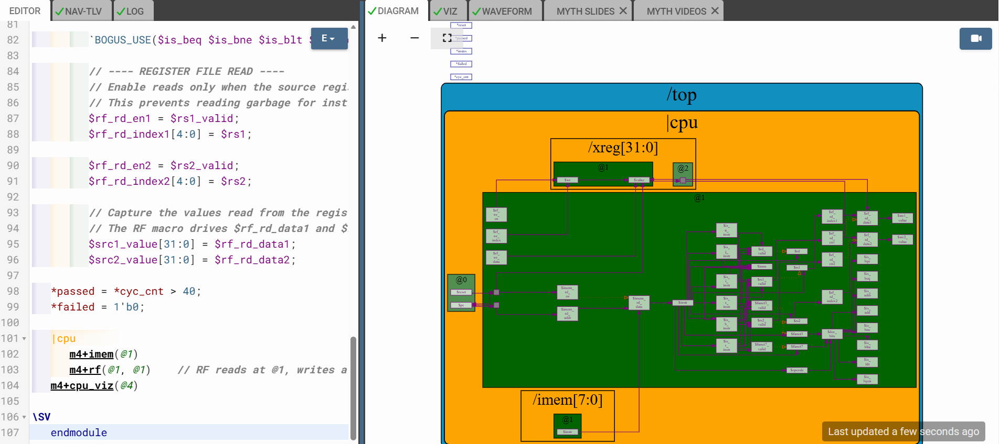
---

### Lab: ALU — ADD and ADDI (Slide 18)

#### Concept

Initial ALU handles only ADD and ADDI. All other opcodes produce `32'bx`.

#### Code

```tlv
// ADDI — add register value and sign-extended immediate
         // ADD  — add two register values together
         // All other opcodes → don't care (32'bx)
         // =============================================
         $result[31:0] = $is_addi ? $src1_value + $imm        :
                         $is_add  ? $src1_value + $src2_value  :
                                    32'bx;

```
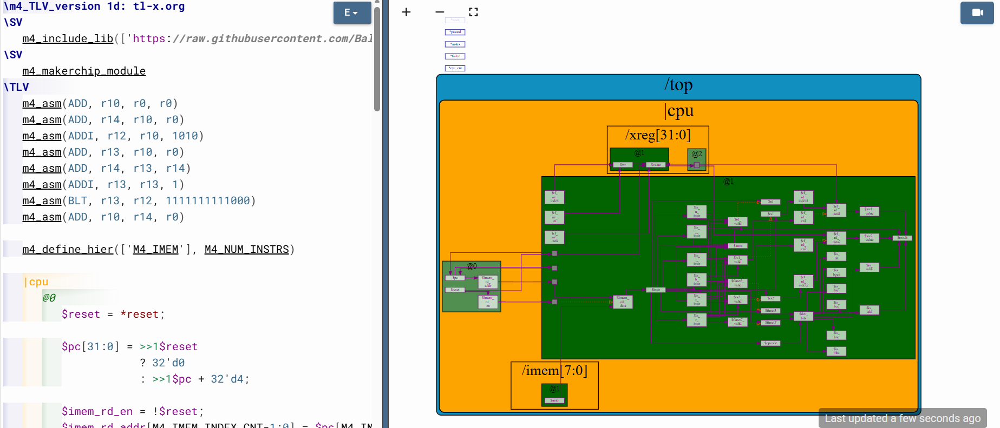
---

### Lab: Register File Write (Slide 20)

#### Concept

RF write enabled only when `rd` is valid and not x0 (x0 hardwired zero).

#### Code

```tlv
/ Condition 1: instruction must have a valid rd field
         // Condition 2: destination must not be x0 (always-zero reg)
         //              x0 writes are silently ignored in RISC-V
         // =============================================
         $rf_wr_en         = $rd_valid && ($rd != 5'b00000);
         $rf_wr_index[4:0] = $rd;
         $rf_wr_data[31:0] = $result;
```
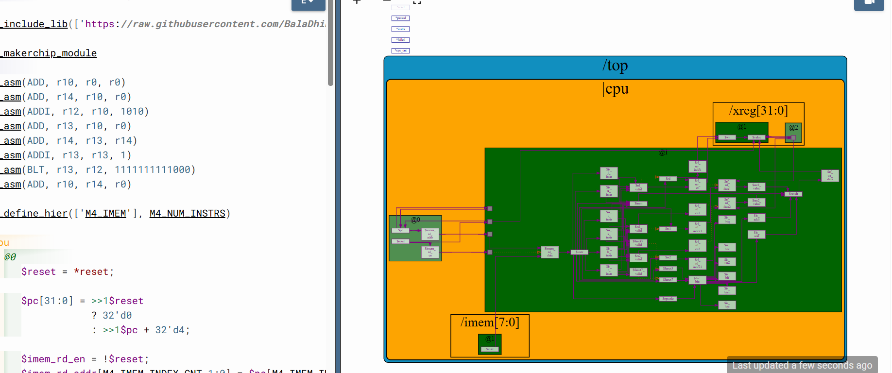
---

### Lab: Branches — Taken Branch Logic (Slide 21)

#### Concept

Each branch type has its own comparison. BLT/BGE handle signed comparison
via XOR of sign bits.

| Instruction | Condition |
|-------------|-----------|
| BEQ | src1 == src2 |
| BNE | src1 != src2 |
| BLT | (src1 < src2) XOR (sign bits differ) |
| BGE | (src1 >= src2) XOR (sign bits differ) |
| BLTU | src1 < src2 (unsigned) |
| BGEU | src1 >= src2 (unsigned) |

#### Code

```tlv
$taken_br = $is_beq  ? ($src1_value == $src2_value)                                         :
            $is_bne  ? ($src1_value != $src2_value)                                         :
            $is_blt  ? (($src1_value < $src2_value) ^ ($src1_value[31] != $src2_value[31])) :
            $is_bge  ? (($src1_value >= $src2_value) ^ ($src1_value[31] != $src2_value[31])):
            $is_bltu ? ($src1_value < $src2_value)                                          :
            $is_bgeu ? ($src1_value >= $src2_value)                                         :
                       1'b0;
```
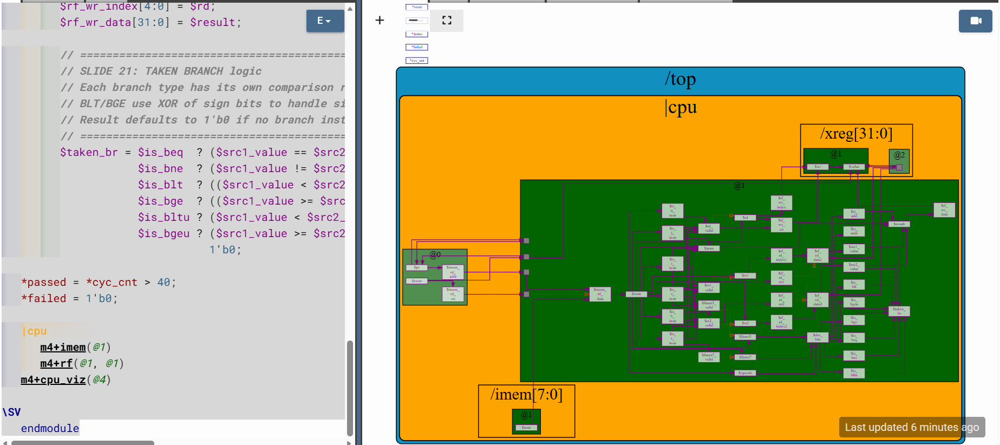
---

### Lab: Branch Target PC and PC MUX (Slide 22)

#### Concept

Branch target = PC + sign-extended B-type immediate. PC MUX priority:
reset → 0, taken branch → branch target, else → PC + 4.

#### Code

```tlv
$br_tgt_pc[31:0] = $pc + $imm;

$pc[31:0] = >>1$reset    ? 32'd0         :
            >>1$taken_br ? >>1$br_tgt_pc :
                           >>1$pc + 32'd4;
```
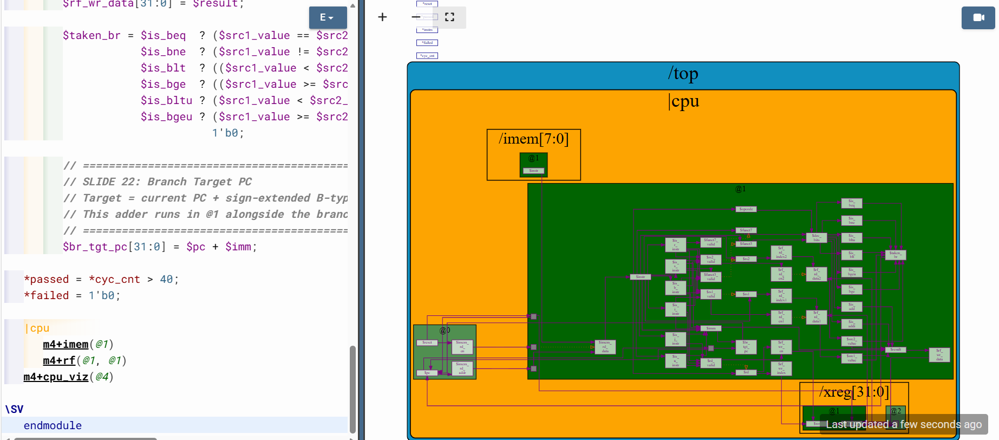
---

## Day 5 Labs — Pipelining

---

## Lab: 3-Cycle Valid Signal (Slide 33)

### Concept

Only one instruction is valid every 3 cycles. `$start` fires once after
reset deasserts. `>>3$valid` recycles the valid pulse every 3 cycles.

### Code

```tlv
/ =============================================
         // SLIDE 33: $start and $valid signals
         // $start = last cycle had reset, this cycle does not
         //          → marks the very first valid instruction cycle
         // $valid = 0 during reset
         //          1 on $start (first active cycle)
         //          otherwise recycle >>3$valid (every 3rd cycle valid)
         // =============================================
         $start = >>1$reset && !$reset;

         $valid = $reset ? 1'b0
                : $start ? 1'b1
                         : >>3$valid;
```

### Full TL-Verilog File

```tlv
\m4_TLV_version 1d: tl-x.org
\SV
   m4_include_lib(['https://raw.githubusercontent.com/BalaDhinesh/RISC-V_MYTH_Workshop/master/tlv_lib/risc-v_shell_lib.tlv'])
\SV
   m4_makerchip_module
\TLV
   m4_asm(ADD, r10, r0, r0)
   m4_asm(ADD, r14, r10, r0)
   m4_asm(ADDI, r12, r10, 1010)
   m4_asm(ADD, r13, r10, r0)
   m4_asm(ADD, r14, r13, r14)
   m4_asm(ADDI, r13, r13, 1)
   m4_asm(BLT, r13, r12, 1111111111000)
   m4_asm(ADD, r10, r14, r0)

   m4_define_hier(['M4_IMEM'], M4_NUM_INSTRS)

   |cpu
      @0
         $reset = *reset;
         $start = >>1$reset && !$reset;
         $valid = $reset ? 1'b0 : $start ? 1'b1 : >>3$valid;

         $pc[31:0] = >>1$reset     ? 32'd0         :
                     >>1$taken_br  ? >>1$br_tgt_pc :
                                     >>1$pc + 32'd4;

         $imem_rd_en = !$reset;
         $imem_rd_addr[M4_IMEM_INDEX_CNT-1:0] = $pc[M4_IMEM_INDEX_CNT+1:2];

      @1
         $instr[31:0] = $imem_rd_data[31:0];

         $is_i_instr = $instr[6:2] ==? 5'b0000x || $instr[6:2] ==? 5'b001x0 ||
                       $instr[6:2] ==? 5'b11001 || $instr[6:2] ==? 5'b11100;
         $is_r_instr = $instr[6:2] ==? 5'b01011 || $instr[6:2] ==? 5'b0110x ||
                       $instr[6:2] ==? 5'b10100;
         $is_s_instr = $instr[6:2] ==? 5'b0100x;
         $is_b_instr = $instr[6:2] ==? 5'b11000;
         $is_j_instr = $instr[6:2] ==? 5'b11011;
         $is_u_instr = $instr[6:2] ==? 5'b0x101;

         $imm[31:0] = $is_i_instr ? { {21{$instr[31]}}, $instr[30:20] } :
                      $is_s_instr ? { {21{$instr[31]}}, $instr[30:25], $instr[11:7] } :
                      $is_b_instr ? { {20{$instr[31]}}, $instr[7], $instr[30:25], $instr[11:8], 1'b0 } :
                      $is_u_instr ? { $instr[31:12], 12'b0 } :
                      $is_j_instr ? { {12{$instr[31]}}, $instr[19:12], $instr[20], $instr[30:21], 1'b0 } :
                                    32'b0;

         $rs1_valid    = $is_r_instr || $is_i_instr || $is_s_instr || $is_b_instr;
         $rs2_valid    = $is_r_instr || $is_s_instr || $is_b_instr;
         $rd_valid     = $is_r_instr || $is_i_instr || $is_u_instr || $is_j_instr;
         $funct3_valid = $is_r_instr || $is_i_instr || $is_s_instr || $is_b_instr;
         $funct7_valid = $is_r_instr;

         ?$rs1_valid    $rs1[4:0]    = $instr[19:15];
         ?$rs2_valid    $rs2[4:0]    = $instr[24:20];
         ?$rd_valid     $rd[4:0]     = $instr[11:7];
         ?$funct3_valid $funct3[2:0] = $instr[14:12];
         ?$funct7_valid $funct7[6:0] = $instr[31:25];

         $opcode[6:0]    = $instr[6:0];
         $dec_bits[10:0] = {$funct7[5], $funct3, $opcode};

         $is_beq  = $dec_bits ==? 11'bx_000_1100011;
         $is_bne  = $dec_bits ==? 11'bx_001_1100011;
         $is_blt  = $dec_bits ==? 11'bx_100_1100011;
         $is_bge  = $dec_bits ==? 11'bx_101_1100011;
         $is_bltu = $dec_bits ==? 11'bx_110_1100011;
         $is_bgeu = $dec_bits ==? 11'bx_111_1100011;
         $is_addi = $dec_bits ==? 11'bx_000_0010011;
         $is_add  = $dec_bits ==? 11'b0_000_0110011;

         `BOGUS_USE($is_beq $is_bne $is_blt $is_bge $is_bltu $is_bgeu)

         $rf_rd_en1         = $rs1_valid;
         $rf_rd_index1[4:0] = $rs1;
         $rf_rd_en2         = $rs2_valid;
         $rf_rd_index2[4:0] = $rs2;
         $src1_value[31:0]  = $rf_rd_data1;
         $src2_value[31:0]  = $rf_rd_data2;

         $result[31:0] = $is_addi ? $src1_value + $imm       :
                         $is_add  ? $src1_value + $src2_value :
                                    32'bx;

         $rf_wr_en         = $rd_valid && ($rd != 5'b00000);
         $rf_wr_index[4:0] = $rd;
         $rf_wr_data[31:0] = $result;

         $taken_br = $is_beq  ? ($src1_value == $src2_value)                                         :
                     $is_bne  ? ($src1_value != $src2_value)                                         :
                     $is_blt  ? (($src1_value < $src2_value) ^ ($src1_value[31] != $src2_value[31])) :
                     $is_bge  ? (($src1_value >= $src2_value) ^ ($src1_value[31] != $src2_value[31])):
                     $is_bltu ? ($src1_value < $src2_value)                                          :
                     $is_bgeu ? ($src1_value >= $src2_value)                                         :
                                1'b0;

         $br_tgt_pc[31:0] = $pc + $imm;

   *passed = *cyc_cnt > 40;
   *failed = 1'b0;

   |cpu
      m4+imem(@1)
      m4+rf(@1, @1)
   m4+cpu_viz(@4)
\SV
   endmodule
```

---

## Lab: 3-Cycle RISC-V — Pipelined Stages (Slide 37)

### Concept

Logic distributed across @0–@3. RF configured as `m4+rf(@2, @3)`.
PC MUX uses `>>3` feedback. `$valid_taken_br` computed at @2 using `>>2$valid`.

### Pipeline Stage Map

| Stage | Operations |
|-------|-----------|
| @0 | Reset, valid, PC, IMem addr |
| @1 | Fetch, decode, immediates, field extraction |
| @2 | RF read, bypass, ALU, branch compare, `$valid_taken_br` |
| @3 | RF write gated by `>>3$valid` |

### Full TL-Verilog File

```tlv

\SV
   m4_makerchip_module
\TLV
   
   m4_asm(ADD, r10, r0, r0)
   m4_asm(ADD, r14, r10, r0)
   m4_asm(ADDI, r12, r10, 1010)
   m4_asm(ADD, r13, r10, r0)
   m4_asm(ADD, r14, r13, r14)
   m4_asm(ADDI, r13, r13, 1)
   m4_asm(BLT, r13, r12, 1111111111000)
   m4_asm(ADD, r10, r14, r0)

   m4_define_hier(['M4_IMEM'], M4_NUM_INSTRS)

   |cpu
      @0
         // =============================================
         // STAGE 0: Reset, Valid, PC
         // =============================================
         $reset = *reset;

         $start = >>1$reset && !$reset;

         // Valid pulses every 3 cycles using >>3 feedback
         $valid = $reset ? 1'b0
                         : $start ? 1'b1
                                  : >>3$valid;

         // PC MUX:
         // Priority 1 — reset            → 0
         // Priority 2 — valid taken branch 3 cycles ago → branch target
         // Priority 3 — normal           → previous incremented PC
         $pc[31:0] = >>1$reset
                     ? 32'd0
                     : >>3$valid_taken_br
                       ? >>3$br_tgt_pc
                       : >>3$inc_pc;

         $imem_rd_en = !$reset;
         $imem_rd_addr[M4_IMEM_INDEX_CNT-1:0] = $pc[M4_IMEM_INDEX_CNT+1:2];

      @1
         // =============================================
         // STAGE 1: Fetch + Decode
         // =============================================

         // FETCH
         $instr[31:0] = $imem_rd_data[31:0];

         // Sequential PC — needed for branch target and next PC
         $inc_pc[31:0] = $pc + 32'd4;

         // Instruction type decode
         $is_i_instr = $instr[6:2] ==? 5'b0000x ||
                       $instr[6:2] ==? 5'b001x0 ||
                       $instr[6:2] ==? 5'b11001 ||
                       $instr[6:2] ==? 5'b11100;
         $is_r_instr = $instr[6:2] ==? 5'b01011 ||
                       $instr[6:2] ==? 5'b0110x ||
                       $instr[6:2] ==? 5'b10100;
         $is_s_instr = $instr[6:2] ==? 5'b0100x;
         $is_b_instr = $instr[6:2] ==? 5'b11000;
         $is_j_instr = $instr[6:2] ==? 5'b11011;
         $is_u_instr = $instr[6:2] ==? 5'b0x101;

         // Immediate value construction
         $imm[31:0] = $is_i_instr ? { {21{$instr[31]}}, $instr[30:20] } :
                      $is_s_instr ? { {21{$instr[31]}}, $instr[30:25], $instr[11:7] } :
                      $is_b_instr ? { {20{$instr[31]}}, $instr[7], $instr[30:25], $instr[11:8], 1'b0 } :
                      $is_u_instr ? { $instr[31:12], 12'b0 } :
                      $is_j_instr ? { {12{$instr[31]}}, $instr[19:12], $instr[20], $instr[30:21], 1'b0 } :
                                    32'b0;

         // Field validity flags
         $rs1_valid    = $is_r_instr || $is_i_instr || $is_s_instr || $is_b_instr;
         $rs2_valid    = $is_r_instr || $is_s_instr || $is_b_instr;
         $rd_valid     = $is_r_instr || $is_i_instr || $is_u_instr || $is_j_instr;
         $funct3_valid = $is_r_instr || $is_i_instr || $is_s_instr || $is_b_instr;
         $funct7_valid = $is_r_instr;

         // Register field extraction (conditional on validity)
         ?$rs1_valid
            $rs1[4:0] = $instr[19:15];
         ?$rs2_valid
            $rs2[4:0] = $instr[24:20];
         ?$rd_valid
            $rd[4:0]  = $instr[11:7];
         ?$funct3_valid
            $funct3[2:0] = $instr[14:12];
         ?$funct7_valid
            $funct7[6:0] = $instr[31:25];

         $opcode[6:0] = $instr[6:0];

         // Instruction identification bits
         $dec_bits[10:0] = {$funct7[5], $funct3, $opcode};

         $is_beq  = $dec_bits ==? 11'bx_000_1100011;
         $is_bne  = $dec_bits ==? 11'bx_001_1100011;
         $is_blt  = $dec_bits ==? 11'bx_100_1100011;
         $is_bge  = $dec_bits ==? 11'bx_101_1100011;
         $is_bltu = $dec_bits ==? 11'bx_110_1100011;
         $is_bgeu = $dec_bits ==? 11'bx_111_1100011;
         $is_addi = $dec_bits ==? 11'bx_000_0010011;
         $is_add  = $dec_bits ==? 11'b0_000_0110011;

      @2
         // =============================================
         // STAGE 2: RF Read + ALU + Branch Compare
         // =============================================

         // RF READ
         // Read port 1 — source register 1
         $rf_rd_en1         = $rs1_valid;
         $rf_rd_index1[4:0] = $rs1;

         // Read port 2 — source register 2
         $rf_rd_en2         = $rs2_valid;
         $rf_rd_index2[4:0] = $rs2;

         // Latch read data into source value registers
         $src1_value[31:0] = $rf_rd_data1;
         $src2_value[31:0] = $rf_rd_data2;

         // ALU — only ADD and ADDI implemented for now
         $result[31:0] = $is_addi ? $src1_value + $imm       :
                         $is_add  ? $src1_value + $src2_value :
                                    32'bx;

         // Branch target = current instruction PC + B-type immediate
         $br_tgt_pc[31:0] = $pc + $imm;

         // Branch condition evaluation
         $taken_br = $is_beq  ? ($src1_value == $src2_value)                                         :
                     $is_bne  ? ($src1_value != $src2_value)                                         :
                     $is_blt  ? (($src1_value < $src2_value) ^ ($src1_value[31] != $src2_value[31])) :
                     $is_bge  ? (($src1_value >= $src2_value) ^ ($src1_value[31] != $src2_value[31])):
                     $is_bltu ? ($src1_value < $src2_value)                                          :
                     $is_bgeu ? ($src1_value >= $src2_value)                                         :
                                1'b0;

         // Gate branch redirect with valid signal
         // >>2$valid brings @0 valid forward to this @2 stage
         $valid_taken_br = >>2$valid && $taken_br;

      @3
         // =============================================
         // STAGE 3: RF Write
         // >>3$valid brings the @0 valid of this instruction
         // forward to @3 to gate the write correctly
         // x0 writes are always suppressed (hardwired zero)
         // =============================================
         $rf_wr_en         = >>3$valid && $rd_valid && ($rd != 5'b00000);
         $rf_wr_index[4:0] = $rd;
         $rf_wr_data[31:0] = $result;

   *passed = *cyc_cnt > 40;
   *failed = 1'b0;


   |cpu
      m4+imem(@1)
      m4+rf(@2, @3)
   m4+cpu_viz(@4)
\SV
   endmodule
```
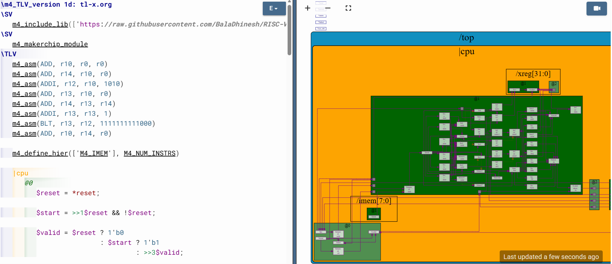
---

## Lab: Register File Bypass (Slide 39)

### Concept

Forwarding prevents RAW hazards by checking if instructions 1 or 2 cycles
ago wrote to the same register and forwarding `$result` directly.

### Code

```tlv
// If the instruction 1 cycle ago wrote to RF AND
         // its destination matches our source register,
         // forward that result instead of stale RF data.
         // >>1 refers to the immediately previous instruction.
         // >>2 refers to two instructions ago.
         // =============================================

         // Bypass for src1:
         // Case 1: instruction 1 ago wrote to rd == rs1 → use >>1$result
         // Case 2: instruction 2 ago wrote to rd == rs1 → use >>2$result
         // Default: use RF read data
         $src1_value[31:0] =
              (>>1$rf_wr_en && (>>1$rd == $rs1)) ? >>1$result :
              (>>2$rf_wr_en && (>>2$rd == $rs1)) ? >>2$result :
                                                   $rf_rd_data1;

         // Bypass for src2:
         $src2_value[31:0] =
              (>>1$rf_wr_en && (>>1$rd == $rs2)) ? >>1$result :
              (>>2$rf_wr_en && (>>2$rd == $rs2)) ? >>2$result :
                                                   $rf_rd_data2;

```
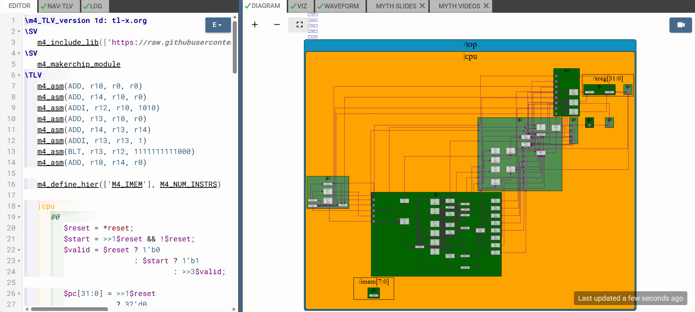
---

## Lab: Branches — ~1 IPC (Slide 42)

### Concept

PC increments every cycle. 2 instructions after a taken branch are
invalidated as bubbles. `$valid` recomputed at @2.

### Waterfall Diagram

```
loop:  add   a4,a3,a4   P D R E W
       addi  a3,a3,1      P D R E W
       blt   a3,a2,loop     P D R E W ──┐ taken
       <bubble>               P D - - -  │
       <bubble>                 P - - -  │
       add   a4,a3,a4 <─────────────────┘
```

### Code

```tlv
  // =============================================
         // whether either of the 2 previous instructions
         // had a valid taken branch — if so this
         // instruction is a bubble (invalid).
         // $valid_taken_br still gates the branch redirect.
         // =============================================
// PC every cycle
$pc[31:0] = >>1$reset          ? 32'd0         :
            >>3$valid_taken_br ? >>3$br_tgt_pc :
                                 >>1$pc + 32'd4;

// Invalidate branch shadow
$valid          = !(>>1$valid_taken_br || >>2$valid_taken_br);
$valid_taken_br = $valid && $taken_br;
```

---

## Lab: Complete Instruction Decode (Slide 44)

### Concept

All RV32I decoded via `{funct7[5], funct3, opcode}`. Loads treated
uniformly via `$is_load` (opcode only). `BOGUS_USE` suppresses warnings.

### RV32I Groups

| Group | Instructions |
|-------|-------------|
| Branch | BEQ BNE BLT BGE BLTU BGEU |
| I-arith | ADDI ANDI ORI XORI SLLI SRLI SRAI SLTI SLTIU |
| R-arith | ADD SUB AND OR XOR SLL SRL SRA SLT SLTU |
| Upper-imm | LUI AUIPC |
| Jump | JAL JALR |
| Store | SB SH SW |
| Load | all → `$is_load` |

### Code

```tlv
$is_beq   = $dec_bits ==? 11'bx_000_1100011;
$is_bne   = $dec_bits ==? 11'bx_001_1100011;
$is_blt   = $dec_bits ==? 11'bx_100_1100011;
$is_bge   = $dec_bits ==? 11'bx_101_1100011;
$is_bltu  = $dec_bits ==? 11'bx_110_1100011;
$is_bgeu  = $dec_bits ==? 11'bx_111_1100011;
$is_addi  = $dec_bits ==? 11'bx_000_0010011;
$is_andi  = $dec_bits ==? 11'bx_111_0010011;
$is_ori   = $dec_bits ==? 11'bx_110_0010011;
$is_xori  = $dec_bits ==? 11'bx_100_0010011;
$is_slli  = $dec_bits ==? 11'b0_001_0010011;
$is_srli  = $dec_bits ==? 11'b0_101_0010011;
$is_srai  = $dec_bits ==? 11'b1_101_0010011;
$is_slti  = $dec_bits ==? 11'bx_010_0010011;
$is_sltiu = $dec_bits ==? 11'bx_011_0010011;
$is_add   = $dec_bits ==? 11'b0_000_0110011;
$is_sub   = $dec_bits ==? 11'b1_000_0110011;
$is_and   = $dec_bits ==? 11'b0_111_0110011;
$is_or    = $dec_bits ==? 11'b0_110_0110011;
$is_xor   = $dec_bits ==? 11'b0_100_0110011;
$is_sll   = $dec_bits ==? 11'b0_001_0110011;
$is_srl   = $dec_bits ==? 11'b0_101_0110011;
$is_sra   = $dec_bits ==? 11'b1_101_0110011;
$is_slt   = $dec_bits ==? 11'b0_010_0110011;
$is_sltu  = $dec_bits ==? 11'b0_011_0110011;
$is_lui   = $dec_bits ==? 11'bx_xxx_0110111;
$is_auipc = $dec_bits ==? 11'bx_xxx_0010111;
$is_jal   = $dec_bits ==? 11'bx_xxx_1101111;
$is_jalr  = $dec_bits ==? 11'bx_000_1100111;
$is_load  = $opcode   ==  7'b0000011;
```

---

## Lab: Complete ALU (Slide 45)

### Concept

Intermediate signals for signed comparisons:
- `$sltu_rslt`  — unsigned src1 < src2
- `$sltiu_rslt` — unsigned src1 < imm

JAL/JALR write `PC + 4` as return address. Loads/stores compute `rs1 + imm`.

### Code

```tlv
$sltu_rslt  = $src1_value < $src2_value;
$sltiu_rslt = $src1_value < $imm;

$result[31:0] =
     $is_addi  ? $src1_value + $imm :
     $is_andi  ? $src1_value & $imm :
     $is_ori   ? $src1_value | $imm :
     $is_xori  ? $src1_value ^ $imm :
     $is_slli  ? $src1_value << $imm[5:0] :
     $is_srli  ? $src1_value >> $imm[5:0] :
     $is_srai  ? { {32{$src1_value[31]}}, $src1_value } >> $imm[4:0] :
     $is_slti  ? ($src1_value[31] == $imm[31])
                  ? $sltiu_rslt : {31'b0, $src1_value[31]} :
     $is_sltiu ? $sltiu_rslt :
     $is_add   ? $src1_value + $src2_value :
     $is_sub   ? $src1_value - $src2_value :
     $is_and   ? $src1_value & $src2_value :
     $is_or    ? $src1_value | $src2_value :
     $is_xor   ? $src1_value ^ $src2_value :
     $is_sll   ? $src1_value << $src2_value[4:0] :
     $is_srl   ? $src1_value >> $src2_value[4:0] :
     $is_sra   ? { {32{$src1_value[31]}}, $src1_value } >> $src2_value[4:0] :
     $is_slt   ? ($src1_value[31] == $src2_value[31])
                  ? $sltu_rslt : {31'b0, $src1_value[31]} :
     $is_sltu  ? $sltu_rslt :
     $is_lui   ? {$imm[31:12], 12'b0} :
     $is_auipc ? $pc + $imm :
     $is_jal   ? $pc + 32'd4 :
     $is_jalr  ? $pc + 32'd4 :
     ($is_load || $is_s_instr) ? $src1_value + $imm :
                  32'bx;
```
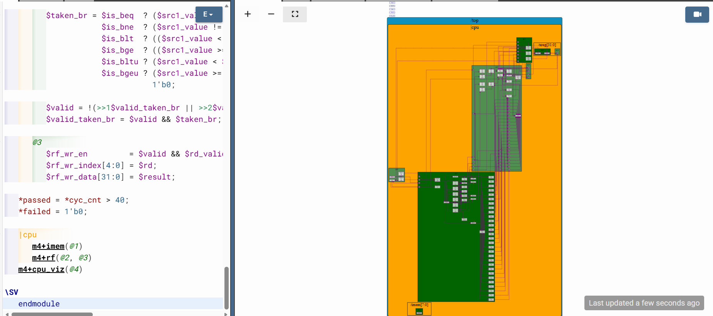
---

## Lab: Load Redirect (Slide 48)

### Concept

A load takes 2 extra cycles (data at @5). 2 shadow instructions are
invalidated and PC redirects to `$inc_pc` (re-fetch the instruction after
the load).

```
load  r2,0(r4)   @0 @1 @2 @3 @4 @5
<bubble>              @0 @1  X  X  X   <- invalidated
<bubble>                 @0  X  X  X   <- invalidated
add   r5,r2,r3  <- re-fetched here
```

### Code

```tlv
 // =============================================
         // Creates 2 invalid shadow cycles just like branch.
         // $valid clears in the 2 cycles after a valid load.
         // =============================================

$valid_load = $valid && $is_load;

$valid = !(>>1$valid_taken_br || >>2$valid_taken_br ||
           >>1$valid_load     || >>2$valid_load);

$pc[31:0] = >>1$reset          ? 32'd0         :
            >>3$valid_taken_br ? >>3$br_tgt_pc :
            >>3$valid_load     ? >>3$inc_pc    :
                                 >>1$pc + 32'd4;
```
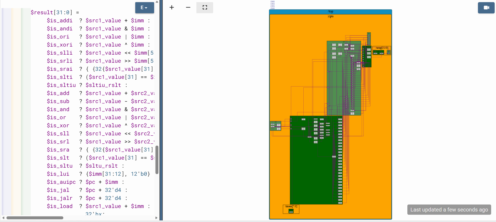
---

## Lab: Load Data — RF Write MUX (Slide 49)

### Concept

Load data arrives at @5. RF write MUX selects `$ld_data`/`>>2$rd` during
the bubble slot 2 cycles after a valid load.

### Code

```tlv
// Normal valid instruction  → write $result
         // 2 cycles after valid load → write $ld_data
         //   (instruction is invalid/bubble but we still
         //    need to commit the loaded value to RF)
         // >>2$valid_load means the load was 2 cycles ago
         // =============================================
$rf_wr_en         = ($valid && $rd_valid && ($rd != 5'b00000)) ||
                    >>2$valid_load;

$rf_wr_index[4:0] = >>2$valid_load ? >>2$rd    : $rd;
$rf_wr_data[31:0] = >>2$valid_load ? $ld_data  : $result;
```
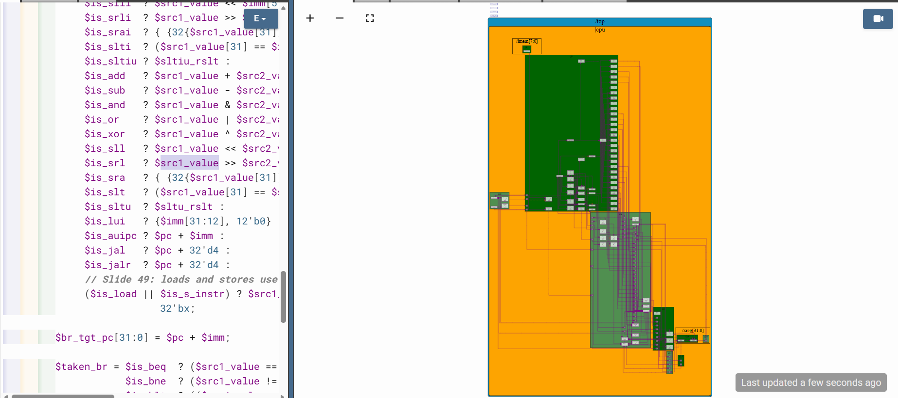
---

## Lab: DMem Connect (Slide 51)

### Concept

`m4+dmem(@4)` — 16-entry, 32-bit wide. Address = result[5:2] (word-aligned).
Store gated by `$valid`. Load data available at @5.

### DMem Interface

| Signal | Description |
|--------|-------------|
| `$dmem_addr[3:0]` | Word address — result[5:2] |
| `$dmem_wr_en` | Write enable — valid store |
| `$dmem_wr_data[31:0]` | Store data — src2_value |
| `$dmem_rd_en` | Read enable — any load |
| `$dmem_rd_data[31:0]` | Returned data — available @5 |

### Code

```tlv
// @3
$dmem_addr[3:0]     = $result[5:2];
$dmem_wr_en         = $valid && $is_s_instr;
$dmem_wr_data[31:0] = $src2_value;
$dmem_rd_en         = $is_load;

// @5
$ld_data[31:0] = $dmem_rd_data[31:0];
```
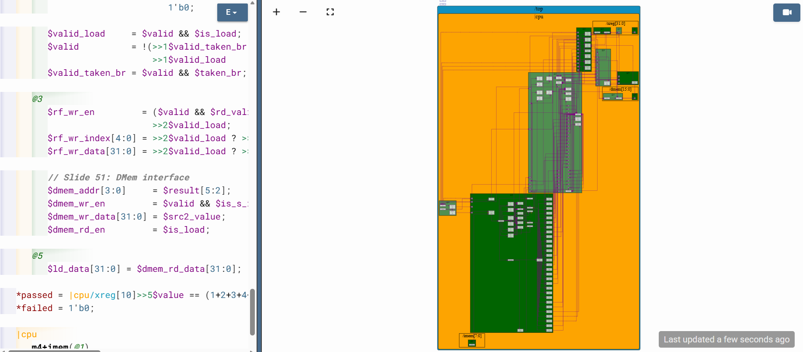
### Macros

```tlv
m4+imem(@1)
m4+rf(@2, @3)
m4+dmem(@4)
m4+cpu_viz(@4)
```

---

## Lab: Load/Store in Test Program (Slide 52)

### Updated Program

```tlv
m4_asm(ADD,  r10, r0,  r0)
m4_asm(ADD,  r14, r10, r0)
m4_asm(ADDI, r12, r10, 1010)
m4_asm(ADD,  r13, r10, r0)
m4_asm(ADD,  r14, r13, r14)
m4_asm(ADDI, r13, r13, 1)
m4_asm(BLT,  r13, r12, 1111111111000)
m4_asm(ADD,  r10, r14, r0)
m4_asm(SW,   r0,  r10, 10000)   // store sum to byte addr 16
m4_asm(LW,   r17, r0,  10000)   // load  byte addr 16 into r17
```

### Updated Testbench

```tlv
*passed = |cpu/xreg[17]>>5$value == (1+2+3+4+5+6+7+8+9);
*failed = 1'b0;
```

---

## Lab: Jumps — JAL / JALR (Slide 53)

### Concept

| Instruction | Target | rd |
|-------------|--------|----|
| JAL | PC + J-IMM (`$br_tgt_pc`) | PC + 4 |
| JALR | SRC1 + I-IMM (`$jalr_tgt_pc`) | PC + 4 |

Both create 2 shadow invalid cycles. Full PC MUX priority order:
reset > branch > load > JAL > JALR > PC+4.

### Code

```tlv
$is_jump           = $is_jal || $is_jalr;
$jalr_tgt_pc[31:0] = $src1_value + $imm;
$valid_jump        = $valid && $is_jump;

$valid = !(>>1$valid_taken_br || >>2$valid_taken_br ||
           >>1$valid_load     || >>2$valid_load     ||
           >>1$valid_jump     || >>2$valid_jump);

$pc[31:0] = >>1$reset
            ? 32'd0
            : >>3$valid_taken_br
              ? >>3$br_tgt_pc
              : >>3$valid_load
                ? >>3$inc_pc
                : (>>3$valid_jump && >>3$is_jal)
                  ? >>3$br_tgt_pc
                  : (>>3$valid_jump && >>3$is_jalr)
                    ? >>3$jalr_tgt_pc
                    : >>1$pc + 32'd4;
```
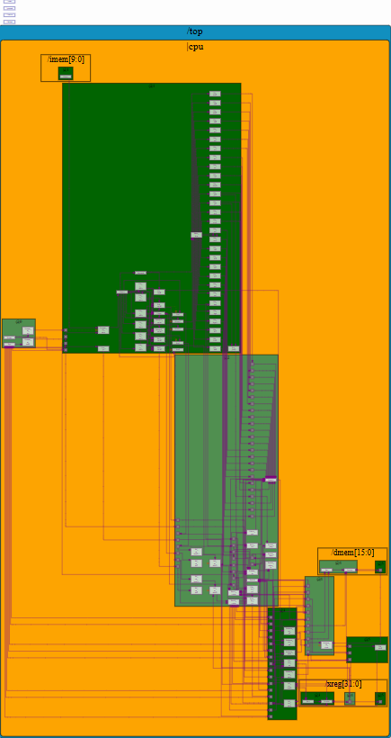
---

## Final Testbench

```tlv
// Without load/store
*passed = |cpu/xreg[10]>>5$value == (1+2+3+4+5+6+7+8+9);

// With load/store
*passed = |cpu/xreg[17]>>5$value == (1+2+3+4+5+6+7+8+9);

*failed = 1'b0;
```

Expected: `r10 = r17 = 45 = 0x2D`

---

## Key Signals Reference

| Signal | Stage | Meaning |
|--------|-------|---------|
| `$reset` | @0 | System reset active high |
| `$start` | @0 | One-shot first active cycle |
| `$valid` | @2 | Real instruction in this slot |
| `$inc_pc` | @1 | PC + 4 |
| `$br_tgt_pc` | @2 | Branch/JAL target: PC + IMM |
| `$jalr_tgt_pc` | @2 | JALR target: SRC1 + IMM |
| `$taken_br` | @2 | Branch condition true |
| `$valid_taken_br` | @2 | Valid AND branch taken |
| `$valid_load` | @2 | Valid AND is load |
| `$valid_jump` | @2 | Valid AND is JAL/JALR |
| `$ld_data` | @5 | 32-bit data from DMem |
| `>>N$signal` | — | Signal from N cycles ago |

---

## Hazard Summary

| Hazard | Root Cause | Solution |
|--------|-----------|----------|
| RAW — register | RF read before write commits | Bypass `>>1$result` / `>>2$result` |
| Control — branch | 2 wrong instructions fetched | Invalidate 2 shadow cycles; redirect PC |
| Control — load | Data unavailable 2 cycles | Invalidate 2 shadow cycles; re-fetch |
| Control — jump | 2 wrong instructions fetched | Invalidate 2 shadow cycles; redirect PC |

---

## References

- Workshop repo: https://github.com/stevehoover/RISC-V_MYTH_Workshop
- Makerchip IDE: https://makerchip.com
- TL-Verilog spec: https://www.redwoodeda.com/tl-verilog
- RISC-V ISA spec: https://riscv.org/technical/specifications/
- VSD MYTH Workshop: https://www.vlsisystemdesign.com
